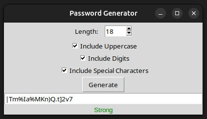

# Password Generator

A simple yet powerful Python-based **Password Generator** that allows you to generate secure and customizable passwords via a **Graphical User Interface (GUI)** or **Command-Line Interface (CLI)**. This project supports various options like including/excluding uppercase letters, digits, and special characters, and features a password strength evaluator.

---

## Features

- **GUI (Graphical User Interface):**
  - Easy-to-use interface to configure and generate passwords.
  - Options to include/exclude:
    - Uppercase letters
    - Digits
    - Special characters
  - Password strength evaluator (Weak, Medium, Strong).
  - Adjustable password length using a spinbox.

  Here is a preview of the Password Generator interface:

  

- **CLI (Command-Line Interface):**
  - Generate single or multiple passwords.
  - Save generated passwords to a file.
  - Customizable options via arguments.

---

## Installation

### Prerequisites
1. Ensure **Python 3.6+** is installed on your system.
2. Install the required dependencies.

### Steps
1. Clone the repository:
   ```bash
   git clone https://github.com/your-username/password-generator.git
   cd password-generator
   ```
2. Install dependencies:
   ```bash
   pip install -r requirements.txt
   ```
   **Note:** If you encounter an issue with `tkinter`, install it using:
   ```bash
   sudo apt install python3-tk  # For Ubuntu/Debian-based systems
   ```

---

## Usage

### Graphical User Interface (GUI)
Run the following command to open the GUI:
```bash
python3 password_generator.py
```
Configure the length and options, then click **Generate** to get your password. The password strength will also be displayed.

---

### Command-Line Interface (CLI)
Run the script with optional arguments to generate passwords directly in the terminal.

#### Single Password
```bash
python3 password_generator.py --length 16
```

#### Multiple Passwords
Generate multiple passwords and optionally save them to a file:
```bash
python3 password_generator.py --batch 5 --length 12 --output passwords.txt
```

#### CLI Arguments:
| **Argument**         | **Description**                                                                                   | **Default** |
|----------------------|---------------------------------------------------------------------------------------------------|-------------|
| `--length`           | Length of the password (8-128).                                                                   | 12          |
| `--no-uppercase`     | Exclude uppercase letters.                                                                        | Included    |
| `--no-digits`        | Exclude digits.                                                                                   | Included    |
| `--no-special-chars` | Exclude special characters.                                                                        | Included    |
| `--batch`            | Number of passwords to generate.                                                                  | 1           | 

This project uses the following Python libraries:
- `tkinter` (built-in for GUI)
- `requests` (for checking password breaches using Have I Been Pwned API)

Install all dependencies via:
```bash
pip install -r requirements.txt
```

---

## Example Outputs

### From GUI:
- Generated Password: `kd<Ne/{<>caLK`
- Strength: **Strong**

### From CLI:
```bash
$ python3 password_generator.py --length 16
Generated Password: `H!mV4zE9pT@qX2Y$`
```

---

## Troubleshooting

### Tkinter Issues
If the GUI doesn't open or you get a `ModuleNotFoundError: No module named 'tkinter'`, install the `tkinter` library:
```bash
sudo apt install python3-tk  # For Ubuntu/Debian
brew install python-tk       # For macOS
```

---

## Acknowledgments

- Inspired by various password management tools.
- Uses the [Have I Been Pwned API](https://haveibeenpwned.com/) for breach checks.

## Disclaimer

This is a personal/educational project, no license applied. Use it as you see fit!
